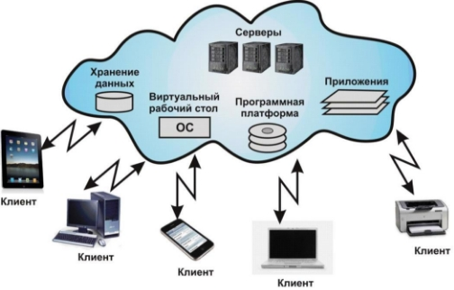

&nbsp;Тема 1.5 **УСТРОЙСТВО И АРХИТЕКТУРА ИНФОРМАЦИОННЫХ СИСТЕМ** 

&ensp;&nbsp;&nbsp;&nbsp;***Архитектура программы или компьютерной системы*** – это структура системы, которая включает элементы программы, видимые извне свойства этих элементов и связи между ними. 

&ensp;&nbsp;&nbsp;&nbsp;Под *архитектурой программных систем* понимают совокупность решений относительно: 
- организации программной системы; 
- выбора структурных элементов, составляющих систему и их интерфейсов; 
- поведения этих элементов во взаимодействии с другими элементами; 
- объединение этих элементов в подсистемы; 
- архитектурного стиля, определяющего логическую и физическую организацию системы: статические и динамические элементы, их интерфейсы и способы исвоей х объединения. 

&ensp;&nbsp;&nbsp;&nbsp;Архитектура программной системы охватывает не только ее структурные и поведенческие аспекты, но и правила ее использования и интеграции с другими системами, функциональность, производительность, гибкость, надежность, возможность повторного применения, полноту, экономические и технологические ограничения, а также вопрос пользовательского интерфейса. 

&ensp;&nbsp;&nbsp;&nbsp;Для того чтобы построить правильную и надежную архитектуру и грамотно спроектировать интеграцию программных систем необходимо четко следовать современным стандартам в этих областях. В качестве законодателей стандартов в этой области выступают такие международные организации как SEI (Software Engineering Institute), WWW (консорциум World Wide Web), OMG (Object Management Group), организация разработчиков Java – JCP (Java Community Process), IEEE (Institute of Electrical and Electronics Engineers) и другие. 

&ensp;&nbsp;&nbsp;&nbsp;Рассмотрим классификацию программных систем по их архитектуре: 
- Централизованная архитектура; 
- Архитектура «файл-сервер»; 
- Двухзвенная архитектура «клиент-сервер»; 
- Многозвенная архитектура «клиент-сервер»; 
- Архитектура распределенных систем; 
- Архитектура Веб-приложений; 
- Сервис-ориентированная архитектура. 

&ensp;&nbsp;&nbsp;&nbsp;**Централизованная архитектура**

&ensp;&nbsp;&nbsp;&nbsp;Централизованная архитектура вычислительных систем реализовывалась на базе мейнфреймов, либо на базе мини-ЭВМ. Характерная особенность такой архитектуры – полная «неинтеллектуальность» терминалов. Их работой управляет хост-ЭВМ. 

&ensp;&nbsp;&nbsp;&nbsp;Достоинства такой архитектуры: 
- пользователи совместно используют дорогие ресурсы ЭВМ и дорогие периферийные устройства; 
- централизация ресурсов и оборудования облегчает обслуживание и эксплуатацию вычислительной системы; 
- отсутствует необходимость администрирования рабочих мест пользователей. Главным недостатком для пользователя является то, что он полностью зависит от администратора хост-ЭВМ. Пользователь не может настроить рабочую среду под свои потребности – все используемое программное обеспечение является коллективным. 

&ensp;&nbsp;&nbsp;&nbsp;Классическое представление централизованной архитектуры показано на рисунке 1. 

&ensp;&nbsp;&nbsp;&nbsp;Рисунок 1 -Классическое представление централизованной архитектуры 

&ensp;&nbsp;&nbsp;&nbsp;Центральная ЭВМ должна иметь большую память и высокую производительность, чтобы обеспечивать комфортную работу большого числа пользователей. 
&ensp;&nbsp;&nbsp;&nbsp;Все приложения, работающие в такой архитектуре, полностью находятся в основной памяти хост-ЭВМ. Терминалы являются лишь устройствами ввода-вывода и таким образом в минимальной степени поддерживают интерфейс пользователя. 

&ensp;&nbsp;&nbsp;&nbsp;**Архитектура «файл-сервер»**

&ensp;&nbsp;&nbsp;&nbsp;Файл-серверные приложения – приложения, схожие по своей структуре с локальными приложениями и использующие сетевой ресурс для хранения программы и данных. 
Функции сервера: хранения данных и кода программы, функции клиента: обработка данных происходит исключительно на стороне клиента.
&ensp;&nbsp;&nbsp;&nbsp;Классическое представление информационной системы в архитектуре «файл- сервер» представлено на рисунке 2. 

&ensp;&nbsp;&nbsp;&nbsp;Рисунок 2 - Классическое представление архитектуры «файл-сервер»

&ensp;&nbsp;&nbsp;&nbsp;Архитектура файл-сервер только извлекает данные из файлов так, что дополнительные пользователи и приложения добавляют лишь незначительную нагрузку на центральный процессор. Каждый новый клиент добавляет вычислительную мощность к сети. 

&ensp;&nbsp;&nbsp;&nbsp;Достоинства такой архитектуры: 
- многопользовательский режим работы с данными; 
- удобство централизованного управления доступом; 
- низкая стоимость разработки; 
- высокая скорость разработки; 
- невысокая стоимость обновления и изменения ПО. 

&ensp;&nbsp;&nbsp;&nbsp;Недостатки: 
- проблемы многопользовательской работы с данными: последовательный доступ, отсутствие гарантии целостности; 
- низкая производительность (зависит от производительности сети, сервера, клиента); 
- плохая возможность подключения новых клиентов; 
- ненадежность системы. 

&ensp;&nbsp;&nbsp;&nbsp;**Архитектура «клиент-сервер»** 

&ensp;&nbsp;&nbsp;&nbsp;Клиент-сервер – вычислительная или сетевая архитектура, в которой задания или сетевая нагрузка распределены между поставщиками услуг (сервисов), называемых серверами, и заказчиками услуг, называемых клиентами. Нередко клиенты и серверы взаимодействуют через компьютерную сеть и могут быть как различными физическими устройствами, так и программным обеспечением. Схематически такую архитектуру можно представить, как показано на рисунке 3. 

&ensp;&nbsp;&nbsp;&nbsp;Рисунок 3 - Классическое представление архитектуры «клиент-сервер»

&ensp;&nbsp;&nbsp;&nbsp;На стороне клиента выполняется код приложения, в который обязательно входят компоненты, поддерживающие интерфейс с конечным пользователем, производящие отчеты, выполняющие другие специфичные для приложения функции.
&ensp;&nbsp;&nbsp;&nbsp;Клиентская часть приложения взаимодействует с клиентской частью программного обеспечения управления базами данных, которая, фактически, является индивидуальным представителем СУБД для приложения. 
&ensp;&nbsp;&nbsp;&nbsp;Особенностью архитектуры клиент-сервер является использование выделенных серверов баз данных, понимающих запросы на языке структурированных запросов SQL (Structured Query Language) и выполняющих поиск, сортировку и агрегирование информации. 

&ensp;&nbsp;&nbsp;&nbsp;Преимуществами данной архитектуры являются: 
- возможность, в большинстве случаев, распределить функции вычислительной системы между несколькими независимыми компьютерами в сети; 
- все данные хранятся на сервере, который, как правило, защищен гораздо лучше большинства клиентов, а также на сервере проще обеспечить контроль полномочий, чтобы разрешать доступ к данным только клиентам с соответствующими правами доступа; 
- поддержка многопользовательской работы; 
- гарантия целостности данных. 

&ensp;&nbsp;&nbsp;&nbsp;Недостатки: 
- неработоспособность сервера может сделать неработоспособной всю вычислительную сеть; 
- администрирование данной системы требует квалифицированного профессионала; 
- высокая стоимость оборудования; 
- бизнес логика приложений осталась в клиентском ПО. 

&ensp;&nbsp;&nbsp;&nbsp;В настоящее время архитектура клиент-сервер получила признание и широкое распространение как способ организации приложений для рабочих групп и информационных систем корпоративного уровня. 

&ensp;&nbsp;&nbsp;&nbsp;**Многоуровневый «клиент-сервер»** 

&ensp;&nbsp;&nbsp;&nbsp;Многоуровневая архитектура клиент-сервер – разновидность архитектуры клиент-сервер, в которой функция обработки данных вынесена на один или несколько отдельных серверов. Это позволяет разделить функции хранения, обработки и представления данных для более эффективного использования возможностей серверов и клиентов. 

&ensp;&nbsp;&nbsp;&nbsp;Среди многоуровневой архитектуры клиент-сервер наиболее распространена трехуровневая архитектура: 
- нижний уровень представляет собой приложения клиентов, имеющие программный интерфейс для вызова приложения на среднем уровне; 
- средний уровень представляет собой сервер приложений; 
- верхний уровень представляет собой удаленный специализированный сервер базы данных. 
&ensp;&nbsp;&nbsp;&nbsp;Схематически такую архитектуру можно представить, как показано на рисунке 4. 

&ensp;&nbsp;&nbsp;&nbsp;Терминал – это интерфейсный (обычно графический) компонент, который представляет приложение для конечного пользователя. Первый уровень не должен иметь прямых связей с базой данных (по требованиям безопасности), быть нагруженным основной бизнес-логикой (по требованиям масштабируемости) и хранить состояние приложения (по требованиям надежности). Сервер приложений располагается на втором уровне, на котором сосредоточена большая часть бизнес-логики. 

&ensp;&nbsp;&nbsp;&nbsp;Рисунок 4 - Многоуровневая архитектура «клиент-сервер»

&ensp;&nbsp;&nbsp;&nbsp;Сервер базы данных обеспечивает хранение данных, обычно это стандартная реляционная или объектно-ориентированная СУБД. Если третий уровень представляет собой базу данных вместе с хранимыми процедурами, триггерами и схемой, описывающей приложение в терминах реляционной модели, то второй уровень строится как программный интерфейс, связывающий клиентские компоненты с прикладной логикой базы данных. 

&ensp;&nbsp;&nbsp;&nbsp;Плюсами данной архитектуры являются: 
- клиентское ПО не нуждается в администрировании; 
- масштабируемость; 
- конфигурируемость – изолированность уровней друг от друга позволяет быстро и простыми средствами переконфигурировать систему при возникновении сбоев или при плановом обслуживании на одном из уровней; 
- высокая безопасность; 
- высокая надежность; 
- низкие требования к скорости канала (сети) между терминалами и сервером приложений;
- низкие требования к производительности и техническим характеристикам терминалов, как следствие снижение их стоимости. 

&ensp;&nbsp;&nbsp;&nbsp;Минусы:
- растет сложность серверной части и, как следствие, затраты на администрирование и обслуживание; 
- более высокая сложность создания приложений; 
- сложнее в разворачивании и администрировании; 
- высокие требования к производительности серверов приложений и сервера базы данных, а, значит, и высокая стоимость серверного оборудования; 
- высокие требования к скорости канала (сети) между сервером базы данных и серверами приложений. 

&ensp;&nbsp;&nbsp;&nbsp;**Архитектура распределенных систем** 

&ensp;&nbsp;&nbsp;&nbsp;Такой тип систем является более сложным с точки зрения организации системы. Суть распределенной системы заключается в том, чтобы хранить локальные копии важных данных. Схематически такую архитектуру можно представить, как показано на рисунке 5. 

&ensp;&nbsp;&nbsp;&nbsp;Рисунок 5 - Архитектура распределенных систем

&ensp;&nbsp;&nbsp;&nbsp;Каждый АРМ независим, содержит только ту информацию, с которой должен работать, а актуальность данных во всей системе обеспечивается благодаря непрерывному обмену сообщениями с другими АРМами. Обмен сообщениями между АРМами может быть реализован различными способами, от отправки данных по электронной почте до передачи данных по сетям.
&ensp;&nbsp;&nbsp;&nbsp;Еще одним из преимуществ такой схемы эксплуатации и архитектуры системы, является обеспечение возможности персональной ответственности за сохранность данных. Так как данные, доступные на конкретном рабочем месте, находятся только на этом компьютере, при использовании средств шифрования и личных аппаратных ключей исключается доступ к данным посторонних, в том числе и IT администраторов. 
&ensp;&nbsp;&nbsp;&nbsp;Такая архитектура системы также позволяет организовать распределенные вычисления между клиентскими машинами. Например, расчет какой-либо задачи, требующей больших вычислений, можно распределить между соседними АРМами благодаря тому, что они, как правило, обладают одной информацией в своих БД и, таким образом, добиться максимальной производительности системы. 
&ensp;&nbsp;&nbsp;&nbsp;*Распределенные системы с репликацией.* Данными между различными рабочими станциями и централизованным хранилищем данных, передаются репликацией (рис.6). При вводе информации на рабочих станциях – данные также записываются в локальную базу данных, а лишь затем синхронизируются. 

&ensp;&nbsp;&nbsp;&nbsp;Рисунок 6 -Архитектура распределенных систем с репликацией

&ensp;&nbsp;&nbsp;&nbsp;*Распределенные системы с элементами удаленного исполнения.* Существуют определенные особенности, которые невозможно качественно реализовать на обычной распределенной системе репликативного типа. К этим особенностям можно отнести: 
- использование данных из сущностей, которые хранятся на удаленном сервере (узле); 
- использование данных из сущностей, хранящихся на разных серверах (узлах) частично; 
- использование обособленного функционала, на выделенном сервере (узле). 

&ensp;&nbsp;&nbsp;&nbsp;У каждого из описанных типов используется общий принцип: программа клиент или обращается к выделенному (удаленному) серверу непосредственно или обращается к локальной базе, которая инкапсулирует в себе обращение к удаленному серверу (рис.7). 

&ensp;&nbsp;&nbsp;&nbsp;Рисунок 7 - Архитектура распределенных систем с удаленным исполнением

&ensp;&nbsp;&nbsp;&nbsp;**Архитектура Веб-приложений** 
&ensp;&nbsp;&nbsp;&nbsp;Обычно Веб-приложения создаются как приложения в архитектуре «клиент- сервер», но серверная часть имеет различные архитектурные решения. 
&ensp;&nbsp;&nbsp;&nbsp;Первые Веб-приложения представляли собой примитивные файловые серверы, которые возвращали статические HTML-страницы запросившим их клиентам. 
&ensp;&nbsp;&nbsp;&nbsp;Следующим этапом развития Веб стало появление понятия приложений, которые базировались на таких интерфейсах, как CGI и Internet Server API (ISAPI). 
&ensp;&nbsp;&nbsp;&nbsp;*Common Gateway Interface (CGI)* – это стандартный интерфейс работы с серверами, позволяющий выполнять серверные приложения, вызываемые через URL. 
&ensp;&nbsp;&nbsp;&nbsp;Интерфейс ISAPI – это особенность Microsoft Internet Information Server. ISAPI- приложения представляют собой динамические загружаемые библиотеки (DLL), которые выполняются в адресном пространстве Веб-сервера. 
&ensp;&nbsp;&nbsp;&nbsp;Эти два механизма (CGI и ISAPI) послужили основой создания первого типа Веб-приложений, в которых, в зависимости от каких-либо клиентских действий, выполнялся серверный код. Таким образом, стала возможной динамическая генерация содержимого Веб-страниц, и наполнение Веб перестало быть чисто статическим. 
&ensp;&nbsp;&nbsp;&nbsp;Появление нового, высокоуровневого интерфейса, Active Server Pages (ASP), построенного на основе ISAPI-фильтра, упростило задачи генерации HTML-кода, позволило обращаться к компонентам и использовать базы данных. 
&ensp;&nbsp;&nbsp;&nbsp;Вскоре после появления ASP были созданы и другие технологии, реализующие идею размещения внутри Веб-страницы кода, выполняемого Веб-сервером. Наиболее известная из них на сегодняшний день – технология JSP (Java Server Pages), основной идеей которой является однократная компиляция Java-кода (сервлета) при первом обращении к нему, выполнение методов этого сервлета и помещение результатов выполнения этих методов в набор данных, отправляемых в браузер. 
&ensp;&nbsp;&nbsp;&nbsp;С помощью технологии Active Server Pages – ASP .NET можно создавать Веб- приложения и Веб-сервисы, которые не только позволяют реализовать динамическую генерацию HTML-страниц, но и интегрируются с серверными компонентами и могут использоваться для решения широкого круга бизнес-задач, возникающих перед разработчиками современных Веб-приложений. 

&ensp;&nbsp;&nbsp;&nbsp;Другим направлением развития клиентских частей Веб-приложений стало размещение некоторой части логики приложения (такой как проверка корректности вводимых данных) в самом Веб-браузере.
&ensp;&nbsp;&nbsp;&nbsp;Обобщая вышесказанное можно выделить основные особенности веб- архитектуры: 
- отсутствие необходимости использовать дополнительное ПО на стороне 
клиента – это позволяет автоматически реализовать клиентскую часть на всех платформах; 
- возможность подключения практически неограниченного количества клиентов; 
- благодаря единственному месту хранения данных и наличия системы управления базами данных обеспечиваются минимальные требования для поддержания целостности данных; 
- доступность при работоспособности сервера и каналов связи; 
- недоступность при отсутствии работоспособности сервера или каналов связи; 
- достаточно низкая скорость Веб сервера и каналов передачи данных; 
- относительно объема данных – архитектура Веб систем не имеет существенных ограничений. 

&ensp;&nbsp;&nbsp;&nbsp;Схематически такую архитектуру (в трехзвенном варианте) можно представить, как показано на рисунке 8. 

&ensp;&nbsp;&nbsp;&nbsp;Рисунок 8 - Архитектура Веб-приложений

&ensp;&nbsp;&nbsp;&nbsp;**Сервис-ориентированная архитектура** 

&ensp;&nbsp;&nbsp;&nbsp;**Сервис-ориентированная архитектура** (SOA, service-oriented architecture) – модульный подход к разработке программного обеспечения, основанный на использовании сервисов (служб) со стандартизированными интерфейсами. 
&ensp;&nbsp;&nbsp;&nbsp;Сервисно-ориентированная архитектура основана на использования распределенных информационных ресурсов таких как: приложения и данные, находящихся в сфере ответственности разных владельцев, для достижения желаемых результатов потребителем, которым может быть: конечный пользователь или другое приложение. 
&ensp;&nbsp;&nbsp;&nbsp;Компоненты программы могут быть распределены по разным узлам сети, и предлагаются как независимые, слабо связанные, заменяемые сервисы-приложения. Программные комплексы, разработанные в соответствии с SOA, часто реализуются как набор веб-сервисов, интегрированных при помощи известных стандартных протоколов (SOAP, WSDL, и т. п.) 

&ensp;&nbsp;&nbsp;&nbsp;Принципы SOA: 
- архитектура, как таковая, не привязана к какой-то определенной технологии; 
- независимость организации системы от используемой вычислительной платформы (платформ); 
- независимость организации системы от применяемых языков программирования; 
- использование сервисов, независимых от конкретных приложений, с единообразными интерфейсами доступа к ним; 
- организация сервисов как слабосвязанных компонентов для построения систем. 

&ensp;&nbsp;&nbsp;&nbsp;Главное, что отличает SOA, это использование независимых сервисов, с четко определенными интерфейсами, которые, для выполнения своих задач, могут быть вызваны неким стандартным способом, при условии, что сервисы заранее ничего не знают о приложении, которое их вызовет, а приложение не знает, каким образом сервисы выполняют свою задачу. Эти сервисы взаимодействуют на основе какого- либо строго определенного платформо-независимого и языково-независимого интерфейса (например, WSDL). Определение интерфейса скрывает языково- зависимую реализацию сервиса. 

&ensp;&nbsp;&nbsp;&nbsp;**Кластерные технологии. Облачные серверы** 
&ensp;&nbsp;&nbsp;&nbsp;*Кластер* — группа компьютеров, объединённых высокоскоростными каналами связи, представляющая с точки зрения пользователя единый аппаратный ресурс. Кластер - слабо связанная совокупность нескольких вычислительных систем, работающих совместно для выполнения общих приложений, и представляющихся пользователю единой системой. 

&ensp;&nbsp;&nbsp;&nbsp;Обычно различают следующие основные виды кластеров: 
1) отказоустойчивые кластеры (High-availability clusters, HA, кластеры высокой доступности) 
1) кластеры с балансировкой нагрузки (Load balancing clusters) 
1) вычислительные кластеры (High performance computing clusters, HPC) 
1) системы распределенных вычислений. 

&ensp;&nbsp;&nbsp;&nbsp;*Облачные технологии* - это технологии обработки данных, в которых компьютерные ресурсы предоставляются Интернет-пользователю как онлайн-сервис (рис.9). Облачные технологии – это возможность получить доступ к необходимой информации или вычислительным ресурсам при помощи обычного браузера или приложения из любой точки планеты. Все необходимое обеспечение пользователям предоставляют серверы.* 
&ensp;&nbsp;&nbsp;&nbsp;*Облачное хранилище данных* - модель онлайн-хранилища, в котором данные хранятся на многочисленных распределённых в сети серверах, предоставляемых в пользование клиентам, в основном, третьей стороной. Данные хранятся и обрабатываются в так называемом «облаке», которое представляет собой, с точки зрения клиента, один большой виртуальный сервер. Физически же такие серверы могут располагаться удалённо друг от друга географически. 

&ensp;&nbsp;&nbsp;&nbsp;Рисунок 9 – Облачные технологии

&ensp;&nbsp;&nbsp;&nbsp;*Облачный сервер* — мощная физическая или виртуальная инфраструктура, выполняющая приложения и служащая хранилищем обрабатываемой информации. Облачные серверы создаются с помощью программного обеспечения для виртуализации, позволяющего разделить физический сервер на несколько виртуальных. Организации используют модель инфраструктура как услуга (IaaS) для выполнения задач и хранения информации. Они могут обращаться к функциям виртуального сервера удаленно через веб-интерфейс. 

&ensp;&nbsp;&nbsp;&nbsp;Основные возможности: 
- вычислительная инфраструктура, которая может быть физической, виртуальной или комбинированной, зависит от характера использования. 
- обладает всеми функциональными возможностями локального сервера. 
- позволяет пользователям выполнять интенсивные задачи и хранить большие объемы информации. 
- автоматизированные службы доступны по запросу через API. 
- пользователи могут оплачивать услуги на ежемесячной основе и по мере использования. 
- пользователи могут выбрать план общего хостинга, масштабируемый в зависимости от потребностей. 

&ensp;&nbsp;&nbsp;&nbsp;Облачными хранилищами являются такие интернет-сервисы, как: Dropbox, OneDrive, Google Drive, iCloud, Яндекс.Диск, Облако Mail.Ru. 
