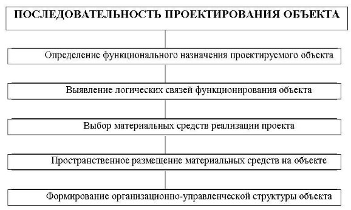

&nbsp;Тема 2.1 **ЖИЗНЕННЫЙ ЦИКЛ ПРОГРАММНОГО ОБЕСПЕЧЕНИЯ ИНФОРМАЦИОННЫХ СИСТЕМ** 

***1. Понятие и этапы жизненного цикла информационных систем***

***Жизненный цикл ИС (ЖЦ)*** – это непрерывный процесс, начинающийся с момента принятия решения о необходимости создания АИС, и заканчивается в момент её полного изъятия из эксплуатации. 

АИС входят в состав СУБД и являются специфическим инструментальным и прикладным (пользовательским) программным обеспечением.

Жизненный цикл АИС является производной жизненного цикла информации, информационных продуктов и услуг, а также технических средств (рис.1). 

Рисунок 1- Связь ЖЦ АИС с другими элементами ЖЦ 

Для АИС условно выделяют следующие **основные этапы их жизненного цикла**:
1) анализ требований — определение того, что должна делать система; 
2) проектирование — определение того, как система будет функционировать: прежде всего спецификация подсистем, функциональных компонентов и способов их взаимодействия в системе; 
3) разработку — создание функциональных компонентов и отдельных подсистем, соединение подсистем в единое целое;
4) тестирование — проверку функционального и параметрического соответствия системы показателям, определенным на этапе анализа; 
5) внедрение — установку и ввод системы в действие; 
6) сопровождение — обеспечение штатного процесса эксплуатации системы на предприятии заказчика.

Завершается жизненный цикл ИС выводом ее из эксплуатации. 

***2. Процессы жизненного цикла*** 

Современные сети разрабатываются на основе стандартов, что позволяет обеспечить их высокую эффективность и возможность их взаимодействия между собой. 

Основной нормативный документ, регламентирующий ЖЦ ПО – базовый международный стандарт **ISO/IEC 12207** (ISO, International Organization of Standardization –  Международная организация по стандартизации;  IEC, International Electrotechnical Commission – Международная комиссия по электротехнике). Он определяет структуру ЖЦ, содержащую процессы, действия и задачи, выполняемые во время создания ПО. 

Каждая из стадий создания системы предусматривает выполнение определённого объёма работ, которые представляются в виде процессов ЖЦ. 

*Процесс* определяется как совокупность взаимосвязанных действий, преобразующих входные данные в выходные. Описание каждого процесса включает в себя перечень решаемых задач, исходных данных и результатов. 

В соответствии с этим стандартом все **процессы ЖЦ ПО** делятся на три группы процессов, каждая из которых включает определённые этапы. 

1) **Основные процессы жизненного цикла,*** являющиеся ключевыми процессами при использовании АИС в организации: 
- *процесс приобретения* - действия и задачи заказчика, приобретающего ПО; 
- *процесс поставки* - действия и задачи, выполняемые поставщиком, который снабжает заказчика программным продуктом или услугой; 
- *процесс разработки* - действия и задачи, выполняемые разработчиком, и работы по созданию ПО и его компонентов в соответствии с заданными требованиями, включая оформление проектной и эксплуатационной документации; подготовку материалов, необходимых для проверки работоспособности и соответствующего качества программных продуктов; материалов, необходимых для организации обучения персонала, и т.д.; 
- *процесс эксплуатации* - действия и задачи оператора – организации эксплуатирующей систему; 
- *процесс сопровождения* - действия и задачи, выполняемые сопровождающей организацией*.* 

2) ***Вспомогательные процессы ЖЦ***, обеспечивающие выполнение основных процессов: 
- *процесс документирования* предусматривает формализованное описание информации, созданной в течение ЖЦ ПО; 
- *процесс управления конфигурацией* предполагает применение административных и технических процедур на всем протяжении ЖЦ ПО для определения состояния компонентов ПО в системе, управления модификациями ПО, описания и подготовки отчетов о состоянии компонентов ПО и запросов на модификацию, обеспечения полноты, совместимости и корректности компонентов ПО, управления хранением и поставкой ПО; 
- *процесс обеспечения качества* обеспечивает соответствующие гарантии того, что ПО и процессы его ЖЦ соответствуют заданным требованиям и утвержденным планам; 
- *процесс верификации* состоит в определении того, что программные продукты, являющиеся результатами некоторого действия, полностью удовлетворяют требованиям или условиям, обусловленным предшествующими действиями *(верификация* в узком смысле означает формальное доказательство правильности ПО);
- *процесс аттестации* предусматривает определение полноты соответствия заданных требований и созданной системы или программного продукта их конкретному функциональному назначению. Под *аттестацией* обычно понимается подтверждение и оценка достоверности проведенного тестирования ПО;
- *процесс совместной оценки* предназначен для оценки состояния работ по проекту и ПО, создаваемого при выполнении данных работ (действий); 
- *процесс аудита* представляет собой определение соответствия требованиям, планам и условиям договора. *Аудит* – это ревизия (проверка), проводимая компетентным органом (лицом) в целях обеспечения независимой оценки степени соответствия ПО или процессов установленным требованиям;*
- *процесс решения проблем* предусматривает анализ и решение проблем (включая обнаруженные несоответствия) независимо от их происхождения или источника, которые обнаружены в ходе разработки, эксплуатации, сопровождения или других процессов. 

3) ***Организационные процессы ЖЦ,*** обеспечивающие организацию деятельности по созданию, эксплуатации и сопровождению АИС: 
- *управление проектом* состоит из действий и задач, которые могут выполняться любой стороной, управляющей своими процессами;
- *процесс создания инфраструктуры проекта АИС* охватывает выбор и поддержку (сопровождение) технологии, стандартов и инструментальных средств, выбор и установку аппаратных и программных средств, используемых для разработки, эксплуатации или сопровождения ПО;
- *процесс усовершенствования АИС* предусматривает оценку, измерение, контроль и усовершенствование процессов ЖЦ ПО; 
- *процесс обучения персонала* охватывает первоначальное обучение и последующее постоянное повышение квалификации персонала. 

Процессы ЖЦ ПО, регламентируемые стандартом ISO/IEC 12207, могут использоваться различными организациями в конкретных проектах самым различным образом. Тем не менее, стандарт предлагает некоторый базовый набор взаимосвязей между процессами с различных точек зрения (или в различных аспектах), который показан на рисунке 2. 

Рисунок 2 - Взаимосвязь между процессами ЖЦ 

3. ***Модели жизненного цикла АИС*** 

***Модель жизненного цикла*** - структура, определяющая последовательность выполнения и взаимосвязи процессов, действий и задач, выполняемых на протяжении всего ЖЦ. 

Модель жизненного цикла отражает различные состояния системы, начиная с момента возникновения необходимости в данной АИС и заканчивая моментом её полного выхода из употребления у всех пользователей. Модель ЖЦ АИС зависит от специфики АИС, специфики условий, в которых последняя создаётся и функционирует. 

На практике наибольшее распространение получили две основные *модели жизненного цикла*: 
- *каскадная модель* (характерна для периода 1970–1985 гг.); 
- *спиральная модель* (характерна для периода после 1986 г.). 

***Каскадная модель*** *(модель* *«водопада»)* предусматривает последовательное выполнение всех этапов проекта в строго фиксированном порядке, при этом переход на следующий этап происходит только после полного завершения работ на текущем (рис.3). 

Рисунок 3 - Каскадная модель жизненного цикла 

Каждый этап завершался после полного выполнения и документального оформления всех предусмотренных работ – выпуском полного комплекта документации, достаточной для того, чтобы разработка могла быть продолжена другой командой разработчиков. При этом этапы работ выполняются в логичной последовательности, что позволяет планировать сроки завершения всех работ и соответствующие затраты. 

Эта модель используется при построении относительно простых АИС, когда в самом начале разработки можно достаточно точно и полно сформулировать все требования к системе. Однако в процессе создания программного обеспечения практически постоянно возникает потребность возвращаться к предыдущим этапам, уточнять или пересматривать ранее принятые решения. Реальный процесс создания ИС принимает следующий вид (рис.4). 

Рисунок 4 - Поэтапная итерационная модель жизненного цикла 

***Поэтапная итерационная модель*** - эта модель создания АИС предполагает наличие циклов обратной связи между этапами. Преимущество такой модели заключается в том, что межэтапные корректировки обеспечивают большую гибкость и меньшую трудоемкость по сравнению с каскадной моделью. В результате затягиваются сроки получения результатов, а пользователи могут вносить замечания лишь по завершению всех работ с системой. При этом модели автоматизируемого объекта могут устареть к моменту их утверждения. 

***Спиральная модель ЖЦ*** предполагает итерационный процесс разработки информационной системы. На каждом витке спирали выполняется создание очередной версии продукта (прототипа), уточняются требования проекта, определяются его качество и планируются работы следующего витка (рис.5). Каждый виток спирали соответствует созданию работоспособного фрагмента или версии ПО (АИС). 

Рисунок 5 - Спиральная модель жизненного цикла 

Это позволяет как можно быстрее показать пользователям системы работоспособный продукт, тем самым активизировать процесс уточнения и дополнения требований. Основная проблема спирального цикла – это определение момента перехода на следующий этап.