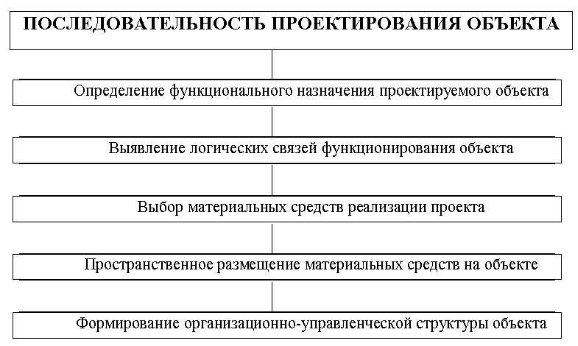

&nbsp;Тема 2.2 **ПОРЯДОК ПРОЕКТИРОВАНИЯ ИНФОРМАЦИОННЫХ СИСТЕМ** 

1. ***Проектирование информационных систем*** 

**Проектирование**  —  разработка  принципов  построения  и  эффективного функционирования  систем,  процессов  и  др.  Это  процесс  обоснованного  выбора характеристик  системы,  формирования  логико-математических  и  экономико- математических моделей, разработки документации. 

Деятельность,  направленная  на  создание  АИС,  называется *разработкой* и (или) *проектированием АИС.* 

***Проектирование информационных систем*** - это упорядоченная совокупность методологий  и  средств  создания  или  модернизации информационных систем,  т.е. детальная разработка отдельных проектных решений, их анализ, апробация и внедрение.  

Проектирование ИС охватывает три основные области: 

- проектирование объектов данных, которые будут реализованы в базе данных; 
- проектирование  программ, экранных  форм,  отчетов,  которые  будут обеспечивать выполнение запросов к данным; 
- учет  конкретной  среды  или  технологии,  а  именно:  топологии  сети, конфигурации  аппаратных  средств,  используемой архитектуры  (файл-сервер или клиент-сервер), параллельной обработки, распределенной обработки данных и т.п. 

Разработка  и  проектирование  АИС  (рис.  1)  начинается  с  создания концептуальной  модели  использования  системы.  Прежде  всего,  должна  быть определена  целесообразность  создания  системы,  ее  конкретные  функции  и подлежащие автоматизации задачи. Далее проводится анализ требований к АИС, детальное проектирование, взаимосвязь этапов, программирование и тестирование, минимизация потерь при переходе от одного уровня представления информации к другому, интеграция в существующую систему, внедрение и поддержка. 

Рисунок 1- Проектирование информационных систем  

В  каждом  подразделении  организации  должен  быть  назначен  сотрудник, *ответственный за проектирование и внедрение АИС*, который собирает нужную информацию,  подбирает  технику  и  программные  средства,  ведет  обучение персонала, руководит внедрением и анализом функционирования информационных систем. 

2. ***Последовательность разработки АИС***  

Существует множество методов и вариантов разработки АИС, использование которых зависит от различных факторов, например, размеров предприятий и (или) их ИС, целей создания ИС, имеющихся ресурсов и др.  

Цикл разработки (проектирования) программного обеспечения - совокупность стадий  и  этапов  разработки  программного  обеспечения  начиная  от  системного анализа и разработки исходных требований до её установки (инсталляции) на ЭВМ.

*Проектирование* любого объекта осуществляется с (рис.2):  

а) *определения* его *функционального назначения* (зачем нужен, что и как делает проектируемый объект),  

б)  *выявления*  *логических  связей*  (как  осуществляет  своё  функциональное назначение проектируемый объект, какая информация и в какой последовательности обрабатывается), 

в)  *выбора  материальных  средств*  реализации  проектируемого  объекта  – функционально-технологический  и  технический  аспект  (носители,  средства обработки данных и др.), 

г) *пространственного* (территориального) *размещения* материальных средств реализации на выделенных или возможных для использования площадях,  

д) *формирования организационно-управленческой структуры* проектируемого объекта  (состав  подразделений,  полномочия  и  функциональные  обязанности работников) 

Рисунок 2- Последовательность проектирования объекта  

После выбора метода проектирования АИС необходимо спланировать комплекс работ  по  созданию  системы  в  соответствии  с  типовыми  этапами  её  разработки. Проект  рассматривается  и  утверждается  Заказчиком.  Проектирование  АИС предполагает выполнение определённых стадий и этапов.  

3. ***Этапы проектирования АИС***  

Для  автоматизации  различных  видов  деятельности  (управление, проектирование,  исследование  и  т.п.),  включая  их  сочетания,  используют положения  **ГОСТ  34.601-90**.  Он  предусматривает  различные  стадии  и  этапы проектирования. 

*Стадия создания автоматизированной  системы  —*  часть  процесса  создания АС,  установленная  нормативными  документами  и  заканчивающаяся  выпуском документации на АС, которая должна содержать модель системы на уровне данной стадии, изготовление несерийных компонентов или приемку АС в эксплуатацию. 

Каждая  стадия  выделена  по  соображениям  рационального  планирования  и организации работ и обязательно должна заканчиваться определенным результатом. Содержание документации на каждой стадии определяется составом и спецификой работ. 

ГОСТ 34.601-90 предусматривает следующие стадии и этапы проектирования (таблица 1). 

Таблица 1 - Стадии и этапы проектирования 

|Стадии  |Этапы  |
| - | - |
|1\. Формирование требований к АС  |
1.1. Обследование объекта и обоснование необходимости создания АС  

1.2. Формирование требований пользователя к АС  

1.3. Оформление отчёта о выполненной работе и заявки на разработку АС  
|
|2\. Разработка  концепции АС  |
2.1. Изучение объекта  

2.2. Проведение необходимых научно-исследовательских работ  

2.3. Разработка вариантов концепции АС и выбор варианта концепции АС, удовлетворяющей пользователя  

2.4. Оформление отчёта о выполненной работе  
|
|3\. Техническое  задание  |3\.1. Разработка и утверждение технического задания на создание АС  |
|4\. Эскизный проект  |
4.1. Разработка предварительных проектных решений по системе и её частям;  

4.2. Разработка документации на АИС и её части  
|
|5\. Технический проект |
5.1. Разработка проектных решений по системе и ее частям; 

5.2. Разработка документации на АИС и ее части; 

5.3. Разработка и оформление документации на поставку комплектующих изделий; 

&emsp;5.4 Разработка заданий на проектирование в смежных частях 

проекта. 
|
|6\. Рабочая документация  |
6.1. Разработка рабочей документации на систему и её части  

6.2. Разработка или адаптация программ  
|
|7\. Ввод в действие  |
7.1. Подготовка объекта автоматизации к вводу АС в действие  

7.2. Подготовка персонала  

7.3. Комплектация АС поставляемыми изделиями (программными и техническими средствами, программно- техническими комплексами, информационными изделиями)  

7.4. Строительно-монтажные работы  

7.5. Пуско-наладочные работы  

7.6. Проведение предварительных испытаний  

7.7. Проведение опытной эксплуатации  

7.8. Проведение приёмочных испытаний  
|
|8\. Сопровождение АС  |
8.1. Выполнение работ в соответствии с гарантийными обязательствами  

8.2. Послегарантийное обслуживание  
|
| :- | :- |

*Техническое  задание* -  это  перечень  основных  эксплуатационных, технологических  экономических  и  других  требований,  которым  должен удовлетворять проектируемый объект на всех этапах его существования.

*Технический  проект*  содержит  принципиальные  электрические  схемы, конструкторскую  документацию  объекта  разработки  и  составные  его  части, перечень выбранных готовых средств программного и технического обеспечения (в том  числе  типов  ЭВМ,  операционной  системы,  прикладных  программ  и  т.д.), алгоритмы  решения  задач  для  разработки  новых  средств  программного обеспечения. 

*Рабочий  проект*  –  заключительный  этап  проектирования,  в  общем  случае предусматривающий  уточнение  и  детализацию  результатов  предыдущих  этапов, создание  и  испытания  опытного  образца  объекта  автоматизации,  разработку  и отработку  программных  продуктов,  технологической  и  эксплуатационной документации.  

Можно выделить три периода создания системы:  

1) предпроектный (стадии 1, 2, 3) 
1) проектирование (стадии 4, 5, 6) 
1) ввод в эксплуатацию (стадии 7, 8) 

Для небольших проектов количество стадий может быть сокращено.  

Таким  образом,  ***проект  ИС***  -  проектно-конструкторская  и  технологическая документация, в которой представлено описание проектных решений по созданию и эксплуатации ИС в конкретной программно-технической среде. 

Выделяют три основных вида проектирования объектов и систем по степени их сложности, объёму и ряду других показателей: 
- *крупные проекты* - при их реализации обычно прибегают к помощи хорошо зарекомендовавших  себя  крупных  компаний-интеграторов,  в  том  числе консалтинговых и внедренческих организаций. 
- *средние проекты* - для их реализации стараются обойтись своими силами и (или)  используют  готовые  решения,  которые  стремятся  адаптировать  под конкретные требования организации-заказчика. 
- *малые  (мелкие)  проекты*  -  характеризуются  использованием  готовых решений  и,  в  ряде  случаев,  адаптацией  их  под  конкретные  условия использования. 