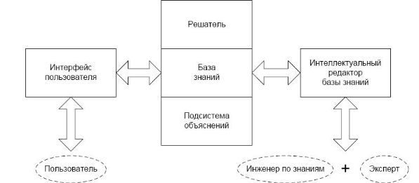

Тема 3.1  **ИНФОРМАЦИОННЫЕ СИСТЕМЫ УПРАВЛЕНИЯ** 

Любая  организация  –  это  совокупность  взаимодействующих  подразделений, каждое  из  которых  может  иметь  свою  иерархическую  структуру  из  нескольких уровней. Подразделения связаны между собой функционально, т.е. они выполняют отдельные виды работ в рамках единого бизнес-процесса, а также информационно, обмениваясь документами, факсами,  письменными  и  устными распоряжениями и т.д. 

Организация, как управляемая система, включает объект и субъект управления. 

*Объектом  управления*  экономического  объекта  является  производственный коллектив,  выполняющий  комплекс  работ,  направленных  на  достижение определенных целей, и располагающий для этого материальными, финансовыми и иными видами ресурсов.  

*Субъект, или система управления*, экономического объекта формирует цели его функционирования и осуществляет контроль их выполнения. 

Целенаправленное воздействие на объект управления, ведущее к изменению, либо сохранению его состояния обеспечивается *управлением*.  

Процесс  управления  может  быть  представлен  в  виде  информационного процесса,  который  связывает  внешнюю  среду,  объект  и  систему  управления предприятием (рис. 1). 

Рисунок 1 – Взаимосвязь системы и объекта управления 

Из  внешней  среды  в  систему  управления  поступает  входной  поток информации,  содержащий  нормативно-регулирующую  информацию  от законодательных  органов,  информацию  о  рынке,  конкурентах,  потребителях, поставщиках.  Исходящий  информационный  поток  из  системы  управления  во внешнюю среду включает в себя отчетную финансовую информацию в финансовые органы,  инвесторам,  кредиторам,  а  также  маркетинговую  информацию потенциальным  потребителям.  Из  системы  управления  в  объект  управления поступает  управляющий  информационный  поток,  представляющий  собой совокупность  плановой,  нормативной  и  распорядительной  информации  для осуществления  хозяйственных  процессов.  От  объекта  управления  в  систему управления  направляется  информационный  поток  обратной  связи,  в  котором отражается  информация  о  состоянии  объекта  управления  (сырья,  материалов, денежных, энергетических, трудовых ресурсов, готовой продукции и выполненных услугах) в результате выполнения хозяйственной деятельности. 

Основными функциями управления экономическим объектом являются:  

*Организационная  функция* заключается  в  разработке  организационной структуры и комплекса нормативных документов: сферы ответственности; штатное расписание; инструкции. 

*Плановая функция* состоит в разработке и реализации планов по выполнению поставленных задач (финансовый план, план проведения научно-исследовательской работы, маркетинговые исследования, бизнес-план). 

*Учетная  функция* заключается  в разработке  или  использовании  уже  готовых форм  и  методов  учета  показателей  деятельности  организации:  финансовый  учет, материальный учет, административный учет. В общем случае ее можно определить как получение, регистрацию, накопление, обработку и предоставление информации о реальных хозяйственных процессах. 

*Аналитическая функция (анализ)* связывается с изучением итогов выполнения планов,  определением  влияющих  факторов,  выявлением  резервов,  изучением тенденций развития и т.д. 

*Контрольная  функция* включает  контроль  за  выполнением  планов, расходованием материальных ресурсов, использованием финансовых средств и т.п. 

*Мотивационная функция  (стимулирование)* предполагает  разработку  и применение  различных  методов  стимулирования  труда  подчиненных  работников (финансовые стимулы, психологические стимулы) 

Выполнение  функций  управления  возлагается  на  аппарат  управления, включающий  службы  и  отделы,  выполняющие  отдельные  функции:  плановый отдел, финансовый отдел, бухгалтерия, отдел сбыта, снабжения и т.д.  

Без привлечения автоматизации практически нельзя контролировать постоянно меняющиеся бизнес-процессы организации. 

***Информационная  система  управления  (ИСУ)***  -  совокупность организационных, технических, программных и информационных средств, которые объединены  в  единую  систему  с  целью  сбора,  хранения,  обработки  и  выдачи информации, которая предназначена для выполнения функций управления (рис.2).***  

Рисунок 2 – Организационно-информационная система управления 

Основными  функциями  таких  систем  являются:  оперативный  контроль  и регулирование,  оперативный  учет  и  анализ,  перспективное  и  оперативное планирование,  бухгалтерский  учет,  управление  сбытом  и  снабжением  и  другие экономические и организационные задачи. 

Целью  *информационной  технологии  управления*  является  удовлетворение информационных  потребностей  всех  без  исключения  сотрудников  организации, имеющих дело с принятием решений. 

Принято выделять 3 уровня систем управления: стратегический, тактический и оперативный  (рис.3).  Каждый  из  этих  уровней  имеет  собственные  задачи,  для решения которых необходимо получить соответствующие данные, например, путем запроса  к  информационной  системе.  С  помощью  информационных  технологий запросы  обрабатываются,  и  формируется  ответ  на  конкретный  запрос. Следовательно, на каждом из трех уровней управления формируется информация, которая служит основой для принятия соответствующих решений. 

Рисунок 3 - Типы ИС в зависимости от функционального признака и уровня 

управления 

1) *Информационные  системы  оперативного  (операционного)  уровня* 

поддерживают  специалистов-исполнителей,  обрабатывая  данные  о  сделках  и событиях  (счета,  накладные,  зарплата,  кредиты  и  т.д.).  Назначение  ИС  на  этом уровне – отвечать на запросы о текущем состоянии и отслеживать поток сделок в фирме, что соответствует оперативному управлению. Чтобы с этим справляться, ИС должна быть  легкодоступной, непрерывно  действующей  и  предоставлять точную информацию. 

2) *ИС функционального (тактического) уровня:* 

а) *ИС специалистов* - ИС этого уровня помогают специалистам, работающим с данными  повышать  продуктивность  и  производительность  работы  инженеров  и проектировщиков.  Задача  подобных  ИС  –  интеграция  новых  сведений  в организацию и помощь в обработке бумажных документов. 

В этом классе ИС можно выделить две группы: 

- ИС  офисной  автоматизации  -  используются  работниками  любого 

организационного  уровня  (бухгалтеры,  секретари).  Основная  цель –  обработка данных повышении эффективности их работы и упрощении канцелярского труда. 

- ИС обработки знаний, в том числе и экспертные системы, вбирают в себя 

знания, необходимые инженерам, юристам, ученым при разработке или создании нового продукта. Их работа заключается в создании новой информации и нового знания. 

б) *ИС для менеджеров среднего звена*. Основные функции этих ИС: 

- сравнение текущих показателей с прошлыми; 
- составление периодических отчетов за определенное время; 
- обеспечение доступа к архивной информации и т.д. 

На этом уровне можно выделить два типа информационных систем: 

- *управленческие*  (для  менеджмента)  обслуживают  управленцев,  которые 

нуждаются в ежедневной и еженедельной информации о состоянии дел. Основное их  назначение  состоит  в  отслеживании  ежедневных  операций  в  фирме  и периодическом  формировании  строго  структурированных  сводных  типовых отчетов. 

- *системы  поддержки  принятия  решений*  обслуживают  частично 

структурированные  задачи,  результаты  которых  трудно  спрогнозировать  заранее. Используют эти системы все, кому необходимо принимать решение: менеджеры, специалисты, аналитики и др. 

3) *Стратегические ИС* - это компьютерная ИС, обеспечивающая поддержку 

принятия  решений  по  реализации  стратегических  перспективных  целей  развития организации.  ИС  стратегического  уровня  помогают  высшему  звену  управленцев решать неструктурированные задачи и осуществлять долгосрочное планирование. Основная задача – сравнение происходящих во внешнем окружении изменений с существующим потенциалом фирмы. 

ИС  делятся  на  две  основных  группы:  интегрированные  и узкоспециализированные системы.  

***Интегрированные  системы.***  К  данному  типу  относятся  корпоративные информационные  системы  (КИС),  которые  интенсивно  вытесняют  традиционные АСУП в сфере управления производством. Они поддерживают конкретные бизнес- процессы предприятий, выполняя наиболее ответственные функции: анализ отчетов, управления финансами и персоналом, себестоимостью и торговыми операциями и т.п.,  их  характерная  особенность  —  способность  работать  в  территориально распределенных  структурах.  Наибольшее  распространения  приобрели  такие корпоративные  информационные  системы:  система  R/3  компании  SAP  AG,  ERP система  «ГАЛАКТИКА»  одноименной  корпорации,  «BAAN-IV»  американско- голландской  компании  Baan  ,  SCALA  шведской  компании  Bestlutsmodeller  AB, пакет  бизнес-прикладных  программ  Oracle  Application  американской  корпорации Oracle. 

***Узкоспециализированные  системы.***  К  ним  относятся:  информационные системы для автоматизации банковской деятельности, информационные системы в статистике,  информационные  системы  для  финансового  и  бухгалтерского  учета (например,  ІС,  FinExpert),  информационные  системы  в  маркетинге, информационные  системы  в  инвестиционном  менеджменте  (например,  Project Expert ) и др.  

**Краткий обзор российского рынка ИСОУ.** В настоящее время на российском рынке информационных систем, помогающим в управлении предприятием, можно выделить три группы. 

***Первая  группа  -  это  крупные  интегрированные  пакеты***  зарубежных разработчиков  класса  MRP  II/ERP,  ориентированные  на  управление  на  основе бизнес-процессов. 

Данную  группу  образуют  комплексы  интегрированных  приложений  для автоматизации  всей  деятельности  предприятия  различного  уровня:  от  крупной корпорации  до  среднего  предприятия.  К  данной  группе  относятся  продукты высшего ценового класса от SAP AG (R/3), ORACLE (Oracle Application), BAAN (BAAN IV), Navision-Microsoft (AXAPTA) и др. Западные системы обычно сделаны «под  ключ»,  поставщики  внедряют  свои  системы  как  самостоятельно,  так  и  с помощью российских партнеров. Формирование стоимости систем трехуровневое и включает стоимость лицензии на инсталляцию, стоимость консалтинга и обучения персонала,  стоимость  настройки  и  внедрения.  Причем  стоимость  настройки  и внедрения в три-четыре раза выше стоимости инсталляции системы. 

***Вторая  группа  -  это  средние  интегрированные  пакеты***  отечественных разработчиков (1С: Предприятие, Галактика, Парус, БОСС-Корпорация). Используя западные  платформы,  например  СУБД  ORACLE,  российские  производители предлагают свои корпоративные системы управления, превосходящие западные по двум основным параметрам - доступным ценам и учету российской специфики уже в исходных модулях. Однако, они еще не достигли полной реализации технологий MRP II/ERP. 

***Третья  -  малые  интегрированные  и  локальные  пакеты***  отечественных разработчиков. 

В таблице 1 приведены примеры наиболее известных систем. 

Таблица 1 – Примеры информационных систем организационного управления 

|**Класс систем** |**Название** |**Разработчик** |**Стоимость, в тыс. $** |
| - | - | - | :-: |
|Крупные интегрированные системы |R/3; Baan IV; Oracle E-Business Suite |SAP; Baan; Oracle |Свыше 500 |
|Средние интегрированные системы |JD  Edwards; SyteLine; Галактика; Парус;  Босс- Корпорация |Edwards;  SOCAP; Галактика,  Россия; Парус,  Россия;  АйТи, Россия |200- 500 |
|Малые интегрированные системы |Concord XAL; Scala; Platinum  SQL; БЭСТ-ПРО |Columbus  IT  Partner; Scala;  Platinum  Software Corporation;  Интеллект- Сервис, Россия |50- 300 |
|Локальные системы |1C; БЭСТ; Инфин |1С,  Россия;  Интеллект- Сервис,  Россия;  Инфин, Россия |5 - 50 |

